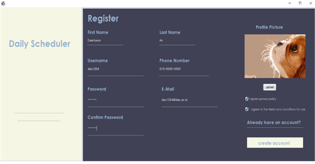
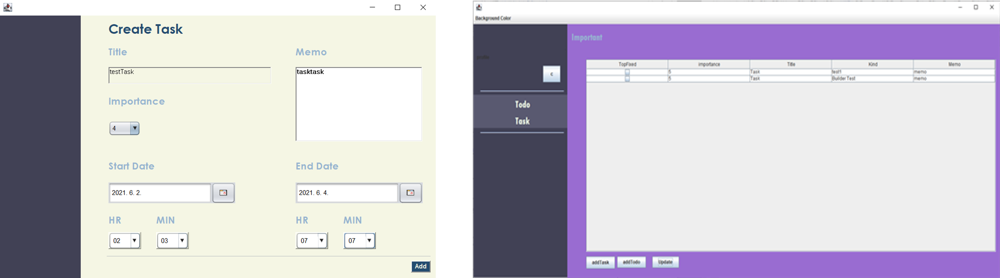
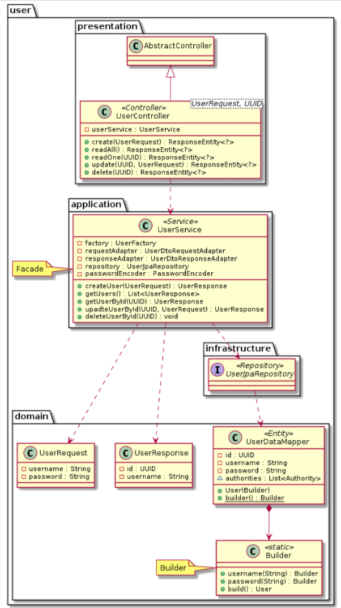
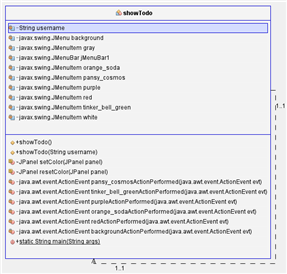
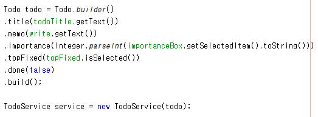
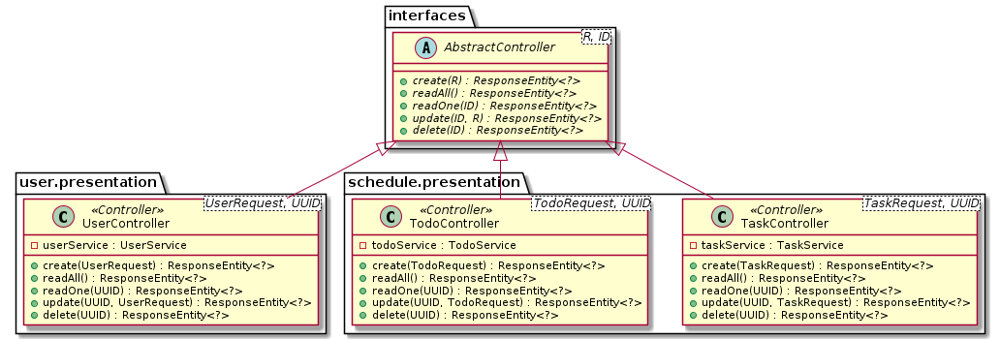
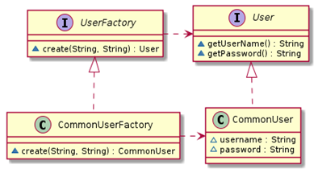
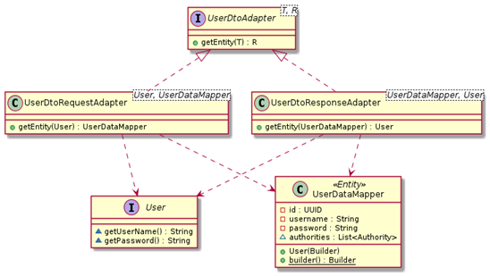
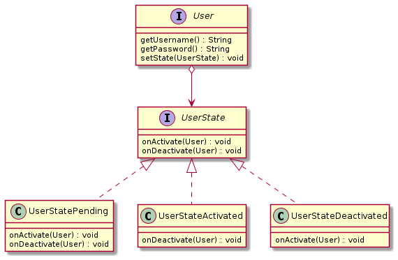

# 2021년도 3학년 1학기 소프트웨어설계공학
<h2 align=left>1분반 2조 데일리 스케줄러 - 프론트</h2>

백엔드는 [daily-scheduler-backend](https://github.com/ads0070/daily-scheduler-backend)에서 보관


## 목차

1. [배경](#1-배경)
2. [개발 환경](#2-개발-환경)
3. [프로젝트 구조](#3-프로젝트-구조)
4. [주요 기능](#4-주요-기능)
5. [디자인 패턴](#5-디자인-패턴)
6. [발표 영상](#6-발표-영상)

## 1. 배경

&nbsp;빠르게 돌아가는 사회 속에서 스케줄을 효율적으로 관리하는 것은 매우 중요하다. 그러나 계속해서 생겨나는 일정과 반복되는 일정 등을 체계적으로 관리하고 실행하기는 쉽지 않은 일이다. 이 때문에 다양한 일정을 손쉽게 관리할 수 있는 스케줄러가 필요하다.

&nbsp;데일리 스케줄러는 처음 스케줄러를 사용하는 사람도 쉽게 사용할 수 있도록 간단한 기능을 통해 일정 추가 및 수정, 삭제를 할 수 있도록 하며 그룹 지정, 백그라운드 지정, 중요도 설정 등의 기능을 제공함으로써 많은 양의 일정도 체계적으로 관리할 수 있도록 한다. 

## 2. 개발 환경

```
* OS : Windows
* Programming Language : Java
* Back-End : Eclipse, Spring Boot
* Front-End : NetBeans
* Version control : Git
```

## 3. 프로젝트 구조

```shell
.
+-- src/
    +-- main/
    |   +-- .../scheduler/
    |       +-- user/
    |           +-- application/
    |           +-- domain/
    |           +-- infrastructure/
    |           +-- presentation/
    +-- test/
        +-- ...
```

DDD(Domain Driven Design)를 바탕으로 하는 레이어드 아키텍처(Layered Architecture)로 구성되어 있습니다.

- Presentation Layer
  - Application의 입출력을 담당하는 Controller
- Application Layer
  - Use Cases(Business Logic)를 구현하는 Service
- Domain Layer
  - Application을 통해 해결하고자 하는 Domain Model
    - cf. Domain과 Infrastructure 영역 사이의 의존 관계를 역전하는 Repository Interface도 Domain Layer에서 구현해야 하나, 개발 편의를 위해 Spring Framework와 결합도를 높이는 형태로 진행함에 따라 별도로 Repository Interface를 구현하지는 않습니다.
- Infrastructure Layer
  - 다른 계층을 위해 사용하는 기반 기술
    - e.g. ORM을 구현하는 Spring JpaRepository 등

## 4. 주요 기능

**1. 회원 관리**  
사용자는 데일리 스케줄러 사용을 위해 회원 가입이 가능하며, 로그인을 통해 서비스를 이용할 수 있다.  
비밀번호 변경, 개인정보 변경이 가능하며 회원 탈퇴도 가능하다.<br/><br/>


**2. 스케줄 관리**  
사용자는 스케줄을 추가, 수정, 삭제할 수 있으며 추가한 스케줄을 확인할 수 있다.<br/><br/>


**3. TODO 관리**  
해야할 일에 대한 목록인 TODO를 추가, 수정, 삭제할 수 있다. TODO는 해당 일을 완료하면 완료 처리할 수 있다.<br/><br/>


**4. 중요 일정 확인**  
스케줄은 중요도 순으로 확인 가능하고, TODO는 중요한 것을 상위에 고정시켜 확인 가능하다.

## 5. 디자인 패턴

**1. 퍼사드 패턴**  
>**문제점**  
>회원 가입과 회원 정보 수정 및 삭제를 할 시에 정보를 서버에 전송해야 한다. 해당 기능을 실행하기 위해서는 많은 과정들 또는 많은 서브 시스템을 거쳐야 하는데 사용자가 직접 하기엔 많은 번거로움과 어려움이 있다.<br/><br/>
>**해결 방안**  
>해당 문제를 해결 하기 위해 퍼사드 패턴을 적용하였다. 퍼사드 패턴을 이용하면 클라이언트가 요청을 할 때에 객체는 서브시스템 내의 특정한 객체에 요청만 하면 되고, 복잡한 소프트웨어를 사용할 수 있게 간단한 인터페이스를 제공함으로써 클라이언트가 보다 쉽게 사용할 수 있다.<br/><br/>


**2. 싱글톤 패턴**  
>**문제점**  
>각 화면에 따른 배경화면 변경 유스케이스를 사용하려면 개별적으로 소스코드가 적용 되어야 한다. 만약 다른 각각의 화면의 배경색을 바꾸려고 했는데 모두가 똑같이 적용이 된다면 원하는 것처럼 개별의 배경색을 지정해 줄 수 없다.<br/><br/>
>**해결 방안**  
>해당 문제를 해결하기 위하여 싱글톤 패턴을 사용하였다. 사용자가 생성자를 여러 차례 호출하여 배경을 여러번 바꾸더라도 하나의 생성자가 리턴되기 때문에 각 화면에 원하는 배경색으로 변경할 수 있다.<br/><br/>


**3. 빌더 패턴**  
>**문제점**  
>회원 가입과 회원 정보 수정 시, 사용자의 정보를 서버로 전송하여 데이터베이스에 기록해야 한다. userService에서 사용자의 정보를 서버로 전송하기 위해 User의 값을 불러와야 하는데 필요한 매개 변수를 불러오기 위해 모든 생성자를 정의하기에는 코드가 복잡해질 수 있고, 입력 값이 추후에 추가된다면 매개 변수의 의미 오역에 의한 오류가 발생할 수도 있다.<br/><br/>
>**해결 방안**  
>해당 문제를 해결하기 위하여 빌더 패턴을 사용하였다. 사용자 객체를 생성할 때, 일일이 값을 입력하여 생성하지 않고 빌더를 통해 한 번에 객체를 생성하여 데이터의 일관성을 유지하고, 가독성을 높여 매개변수에 값이 잘못 들어가 오류가 생길 상황을 방지하였다.<br/><br/>


**4. 템플릿 매서드 패턴**  
>**문제점**  
>사용자(User), Todo일정, Task일정마다 CRUD 처리가 필요하다. 해당 기능을 담당하는 세 가지의 Controller는 세부적인 곳에서는 차이가 있지만 전체적인 틀이 비슷하기 때문에 코드의 중복이 발생하고 있고, CRUD 처리가 필요한 새로운 카테고리가 생길 경우마다 코드가 반복될 것이다.<br/><br/>
>**해결 방안**  
>동일한 구조를 가지는 Controller의 중복되는 코드를 줄이기 위해 일정한 틀을 AbstractController에 갖추어두고, 해당 추상 클래스를 상속받아 UserController, TodoController, TaskController에서 각 역할에 맞게 사용한다.<br/><br/>


**5. 스트레티지 패턴**  
>**문제점**  
>odo 일정을 변경할 때, 사용자는 해당 일정이 끝났음을 체크할 수 있다. Todo 일정과 Task 일정은 일정이 끝난 경우를 지정해주어야 한다. 그러나 Todo는 사용자가 해당 일정을 끝냈다고 done을 체크 해주어야 일정이 끝나고, Task는 사용자가 입력했던 기간 중 endDate가 오늘 날짜를 지난 경우 일정이 끝이난다. 만일 일정의 끝을 체크하는 기준이 달라지거나 새로운 알고리즘이 생긴다면 해당 알고리즘을 슈퍼 클래스에 생성하여 상속의 방법으로 해결하기에는 의도치 않은 클래스에도 알고리즘이 적용되는 문제가 발생할 수 있다.<br/><br/>
>**해결 방안**  
>상속으로 인해 발생할 수 있는 문제를 해결하기 위해 스트레티지 패턴을 적용하여 시스템에서 달라지는 부분을 찾아 분리시켰다. Schedule에서는 일정이 끝났는지를 확인하는 isFinished가 바뀌는 부분이기 때문에 달라지지 않는 부분으로부터 분리시켜, ScheduleStrategy 인터페이스에 세팅하여 구현하였다.<br/><br/>


**6. 팩토리 매서드 패턴**  
>**문제점**  
>사용자가 회원 가입을 하였을 때, 관련 정보가 데이터베이스에 저장되어야 한다. 서버에서 받은 회원 정보를 데이터베이스에 저장하기 위해 구상 클래스를 바탕으로 정보를 객체화하면 새로운 구상 클래스가 추가될 때마다 코드를 고쳐야 한다.<br/><br/>
>**해결 방안**  
>팩토리 메서드 패턴을 사용하여 직접적으로 객체를 생성하지 않고 팩토리 메서드를 통해 위임하여 클래스 간의 결합도를 낮춘다. 객체를 생성하는 코드 부분을 분리 시켰기 때문에 객체를 추가/수정이 일어나더라도 객체를 생성하는 코드만 건들면 되므로 클래스에 변경이 생겼을 때 다른 클래스 영향을 덜 주기 때문이다. 그리고 객체생성 코드를 전부 하나의 객체 또는 메소드에 구현하기 때문에 코드에 중복되는 내용을 제거할 수 있고, 수정에도 용이하다.<br/><br/>


**7. 어댑터 패턴**  
>**문제점**  
>사용자가 회원 가입을 하였을 때, 관련 정보가 데이터베이스에 저장되어야 한다. 이 때, user 객체를 클라이언트가 기대하는 인터페이스로 변환하여 사용할 수 있게 하려면 Target 인터페이스와 호환되도록 클래스를 수정해야 하지만, 비효율적이고 오류를 일으키는 원인이 될 수 있다.<br/><br/>
>**해결 방안**  
>Adaptee 클래스가 Target 인터페이스와 호환되도록 어댑터 패턴을 적용하여 사이에 UserDtoRequestAdapter와 UserDtoResponseAdapter를 두었다.<br/><br/>


**8. 스테이트 패턴**  
>**문제점**  
>사용자 정보를 데이터베이스에 기록할 수 있어야 한다. 이때, 사용자의 상태에 따라 객체를 다르게 처리해야 할 일이 생길 경우 if문이나 switch문을 사용하여 처리할 경우 신규 상태가 발생 했을 때 코드를 전부 수정해야 하는 문제가 생긴다.<br/><br/>
>**해결 방안**  
>객체의 상태 정보를 저장하기 위해 state 패턴을 적용하였다. user 객체가 활동 중인지, 활동 중이지 않은지, 그리고 보류 중인지의 상태에 따라 처리를 할 수 있다.<br/><br/>


## 6. 발표 영상

[](https://youtu.be/Af2WQNUK_AU)
